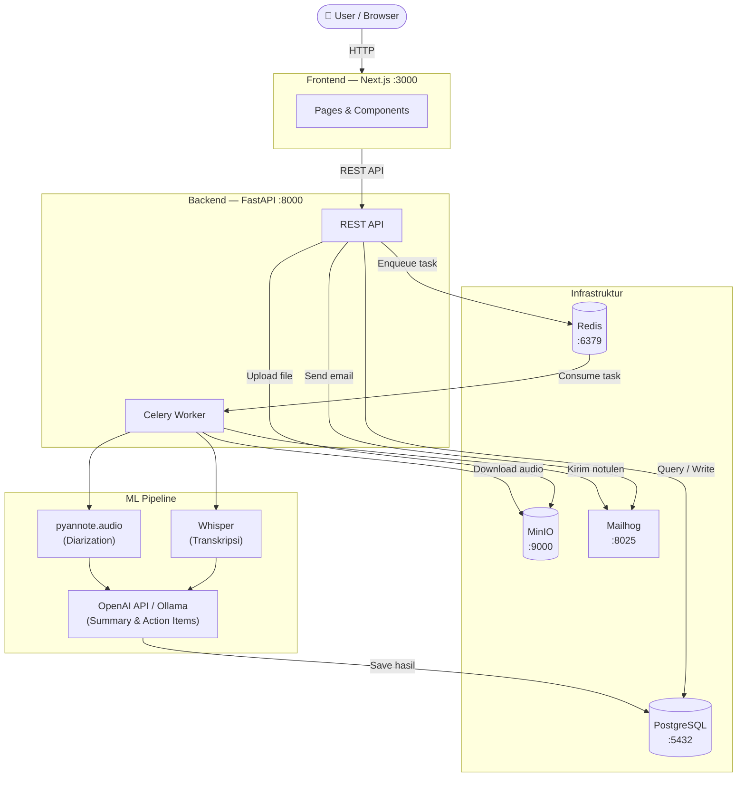

# MeetMate

> Your offline meeting companion. Auto-transcribe, summarize, and distribute notulen with zero cloud dependency.

MeetMate is an end-to-end meeting management application for offline meetings (rapat kantor, FGD, interview). It handles the full meeting lifecycle: scheduling, email invitations, attendance check-in, recording upload, automatic transcription and summarization, and notulen distribution to all participants.

Built fully self-hosted with local LLM. No data leaves your machine.

---

## Features

- Create meeting with schedule, location, agenda, and participant list
- Send email invitations with magic-link check-in (no login required for participants)
- Manual and link-based attendance check-in
- Upload audio recording (mp3, mp4, wav, m4a, max 2 hours)
- Automatic transcription — bilingual Bahasa Indonesia + English (Whisper large-v3)
- Speaker diarization — who said what (pyannote.audio)
- AI-generated summary, key decisions, and action items (Ollama + qwen2.5:7b)
- Auto-distribute notulen via email after processing
- Search across all meetings and notulen content
- CRUD recording document per meeting

---

## Tech Stack

| Layer | Tech |
|---|---|
| Frontend | Next.js, shadcn/ui, Tailwind CSS |
| Backend | FastAPI, Celery, Redis, PostgreSQL |
| ML Pipeline | Whisper large-v3, pyannote.audio, Hybrid LLM (OpenAI API / Ollama qwen2.5:7b) |
| Storage | MinIO (S3-compatible, local) |
| Email | Mailhog (dev) |
| Infra | Docker Compose |

---

## Architecture



**Alur utama recording:**
1. User upload audio → API simpan ke MinIO, taruh task di Redis
2. Celery Worker ambil task → download audio → jalankan Whisper → pyannote → LLM
3. Hasil disimpan ke PostgreSQL
4. Email notulen dikirim otomatis ke semua peserta via Mailhog

---

## Prerequisites

Sebelum menjalankan, pastikan sudah install:

- [Docker + Docker Compose](https://docs.docker.com/get-docker/)
- Python 3.11+ (untuk mode hybrid/lokal)
- Node.js 20+ (untuk mode hybrid/lokal)
- API Key salah satu LLM provider (pilih salah satu):
  - **OpenAI API Key** — rekomendasi, tidak perlu GPU
  - **Ollama** — gratis, butuh GPU dan RAM ≥ 16GB

---

## Cara Menjalankan

Ada dua cara menjalankan MeetMate. Pilih sesuai kebutuhan:

---

### Opsi A: Full Docker (Recommended untuk Demo / Testing Final)

Semua service jalan di Docker. Cukup satu perintah.

**1. Clone & setup env**
```bash
git clone https://github.com/<your-username>/meetmate.git
cd meetmate
cp .env.example .env
```

**2. Isi `.env`** — minimal wajib diisi:
```env
# Pilih LLM provider
LLM_PROVIDER=openai
OPENAI_API_KEY=sk-...       # jika pakai OpenAI
HF_TOKEN=hf_...             # untuk download model pyannote (Hugging Face)
```

> Untuk mendapatkan `HF_TOKEN`: daftar di [huggingface.co](https://huggingface.co) → Settings → Access Tokens.
> Lalu accept license model di:
> - https://huggingface.co/pyannote/speaker-diarization-3.1
> - https://huggingface.co/pyannote/segmentation-3.0

**3. Jalankan semua service**
```bash
make up
```

**4. Jalankan migrasi database**
```bash
make migrate
```

**5. Buka aplikasi**

| Service | URL |
|---|---|
| Aplikasi | http://localhost:3000 |
| Backend API Docs | http://localhost:8000/docs |
| MinIO Console | http://localhost:9001 |
| Mailhog (email preview) | http://localhost:8025 |
| Adminer (DB viewer) | http://localhost:8080 |

> Jika ada perubahan kode, jalankan `make build` untuk rebuild image.

---

### Opsi B: Hybrid (Recommended untuk Development)

Infrastruktur pakai Docker, aplikasi jalankan manual. Hot reload aktif — perubahan kode langsung terlihat tanpa rebuild.

**1. Jalankan infrastruktur saja**
```bash
docker compose up -d postgres redis minio mailhog
```

**2. Jalankan Backend API** (terminal baru, dari folder `backend/`)
```bash
cd backend
pip install -r requirements.txt
alembic upgrade head
uvicorn app.main:app --reload --port 8000
```

**3. Build dan jalankan Celery Worker via Docker** (pertama kali build ~10-15 menit)
```bash
docker compose build celery-worker
docker compose up -d --no-deps celery-worker
```

> Worker dijalankan via Docker (bukan conda lokal) untuk menghindari masalah kompatibilitas DLL di Windows.
> Jika ada perubahan kode di `ml/` atau `ml/requirements.txt`, jalankan ulang kedua command di atas.

> Untuk mendapatkan `HF_TOKEN` dan accept license pyannote — lihat langkah yang sama di Opsi A di atas.
> Model Whisper dan pyannote akan didownload otomatis saat pertama kali memproses recording (~3-4GB).

**4. Jalankan Frontend** (terminal baru, dari folder `frontend/`)
```bash
cd frontend
npm install
npm run dev
```

**5. Setup MinIO bucket** (hanya perlu dilakukan sekali)

Buka http://localhost:9001 → login dengan `minioadmin` / `minioadmin` → buat bucket baru bernama `meetmate-recordings`.

**6. Buka** `http://localhost:3000`

---

### Konfigurasi LLM Provider

Edit file `.env` untuk memilih provider:

```env
# Pakai OpenAI (tidak butuh GPU, rekomendasi untuk laptop biasa)
LLM_PROVIDER=openai
OPENAI_API_KEY=sk-...
OPENAI_MODEL=gpt-4o-mini

# ATAU pakai Ollama lokal (butuh GPU, gratis)
LLM_PROVIDER=ollama
OLLAMA_BASE_URL=http://localhost:11434
OLLAMA_MODEL=qwen2.5:7b
```

Jika pakai Ollama, jalankan dulu di host machine:
```bash
ollama pull qwen2.5:7b
ollama serve
```

Untuk panduan Docker lebih detail, baca [docs/DOCKER_WORKFLOW.md](docs/DOCKER_WORKFLOW.md).

---

## Project Structure

```
meetmate/
├── frontend/          # Next.js app
├── backend/           # FastAPI app + Celery worker
├── ml/                # ML pipeline (Whisper, pyannote, Ollama)
├── docs/              # Documentation
│   ├── PRD.md
│   ├── API_CONTRACT.md
│   ├── ML_INTERFACE.md
│   ├── DOCKER_WORKFLOW.md
│   └── DOCKER_CHANGES.md
├── docker-compose.yml
├── .env.example
└── README.md
```

---

## Team

| Name | Role |
|---|---|
| Audi    | Koordinator, Backend |
| Helena  | Frontend             |
| Azmi    | ML                   |

---

## Development Status

MVP in development. Timeline: 4 weeks.

See [PRD](docs/PRD.md) for full product requirements.

---

## License

[MIT](LICENSE)